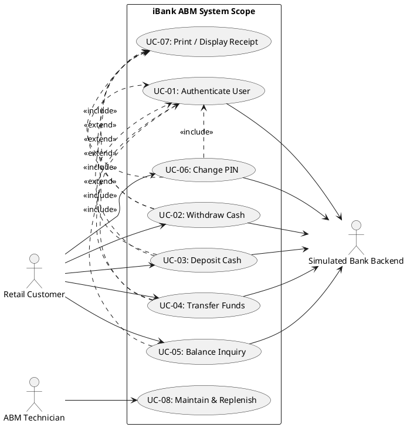

# Problem 3 — iBank Use Case Model

**Course:** SOEN 6611 — Software Measurement  
**Deliverable:** Deliverable 1 (D1)
**Date:** October 2, 2026
**Team Members:**
1. Harshdeep Kaur 
2. Swathi Priya Pasumarthy
3. Syed Shahab Shah

---

## System Boundary & Actor Definitions

### System Boundary & Scope
The **iBank ABM System** serves as an interactive self-service boundary between human users (Customers and Technicians) and the backend enterprise database system. All transactional operations occur within authenticated sessions over simulated Canadian Dollar (CAD) currency accounts (Chequing and Savings).

### System Actor Definitions

| Actor Name | Actor Type | Category | Detailed Description & System Role |
| :--- | :--- | :--- | :--- |
| **Retail Customer** | Primary / Human | External | An authenticated Canadian retail banking customer who initiates self-service banking transactions (withdrawals, deposits, transfers, balance inquiries, and PIN updates)[cite: 3, 4, 5]. |
| **Simulated Bank Backend** | Secondary / System | External | Central simulated banking system that performs account validation, holds master customer records, updates ledger balances in real time, and verifies credential hashes. |
| **ABM Technician** | Secondary / Human | External | Administrative staff responsible for physical and hardware maintenance, diagnostic execution, paper receipt roll replacement, and cash vault replenishment. |

---

## Use Case Catalog & Definitions

### Complete Use Case Catalog

| Use Case ID | Use Case Name | Primary Actor | Brief Description |
| :--- | :--- | :--- | :--- |
| **UC-01** | Authenticate User | Retail Customer | Validates customer payment card credentials and 4-digit PIN against the backend; enforces session lockout after 3 consecutive failures. |
| **UC-02** | Withdraw Cash | Retail Customer | Dispenses requested CAD cash notes from a selected account (Chequing or Savings) following balance and daily limit validation. |
| **UC-03** | Deposit Cash | Retail Customer | Accepts paper currency, counts CAD bills, updates account balances, and posts cash to the selected account. |
| **UC-04** | Transfer Funds | Retail Customer | Moves specified funds between the customer's own linked Chequing and Savings accounts[cite: 5, 9]. |
| **UC-05** | Balance Inquiry | Retail Customer | Displays updated real-time balances for all linked accounts on the high-contrast screen. |
| **UC-06** | Change PIN | Retail Customer | Allows customer to update their session security PIN after verifying the existing PIN and validating formatting rules. |
| **UC-07** | Print / Display Receipt | Supporting / System | Generates an on-screen or printed transaction summary showing account details, transaction type, date, and updated balances. |
| **UC-08** | Maintain & Replenish | ABM Technician | Allows technicians to perform diagnostics, refill CAD note cassettes, and clear hardware errors. |

### Relationship Rules
* **`<<include>>` Relationships:** Core customer transactions (`UC-02` through `UC-06`) mandatorily include `UC-01: Authenticate User` to guarantee credential verification prior to execution.
* **`<<extend>>` Relationships:** Core customer transactions (`UC-02`, `UC-03`, `UC-04`, `UC-06`) optionally extend to `UC-07: Print / Display Receipt` based on customer selection at completion.

---

## UML Use Case Diagram

## CASTROFF framework for UML
Use the CASTROFF framework to design a UML Use Case Model for the iBank Java-based ABM prototype. 
- Context: iBank Canadian retail banking ABM system (handles CAD currency, Chequing, and Savings accounts).
- Audience: SOEN 6611 students and evaluators.
- Style: Formal UML standards (OMG/IEEE notation).
- Task: Identify primary and secondary actors, define core use cases, and propose high-level system boundaries.
- Role: Senior Systems Architect.
- Outcome: A structured breakdown of system actors and transaction use cases.
- Format: Concise Markdown lists.
- Constraints: Maintain strict alignment with P1 scope (no live Interac connection, single authenticated session, fictional accounts).

Act as a UML modeling expert and generate PlantUML code for the iBank Use Case Model derived in Interaction 1. 
- Constraints: Express standard UML 2.5 relationships correctly. Include <<include>> relationships for mandatory authentication and <<extend>> relationships for optional receipt generation. Group use cases logically inside a system boundary rectangle.
- Audience: Software engineering project team.
- Structure: Syntactically valid PlantUML script inside a code block.
- Tone: Technical and precise.
- Role: Lead UML Architect.
- Output: Clean PlantUML code block using left-to-right layout.
- Focus: Architectural clarity and proper notation of actor-usecase associations.
- Function: Produce a visual model representation for presentation slides and technical documentation.

Generate a detailed Use Case Specification for UC-02: Cash Withdrawal in the iBank system.
- Constraints: Define Primary Actor, Supporting Actors, Preconditions, Postconditions, Main Success Scenario, and Extensions/Alternate Flows (e.g., invalid amount, insufficient funds, card lockout).
- Audience: SOEN 6611 instructors and peer evaluators.
- Structure: Formal specification template with numbered step-by-step flows.
- Tone: Rigorous and objective.
- Role: Requirements Engineer.
- Output: Structured Markdown document ready for slide insertion.
- Focus: Functional completeness, exception handling, and consistency with P1 security rules (PIN masking, retry limits).
- Function: Provide full functional specification for core banking transactions.